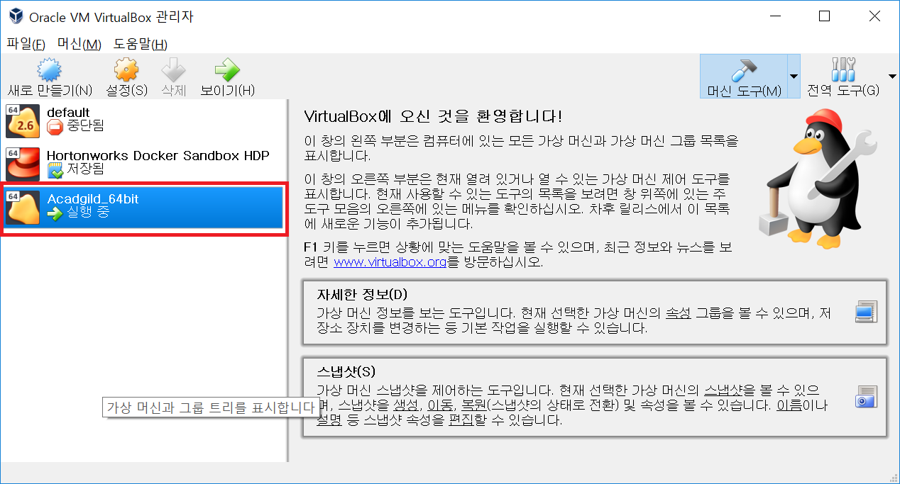
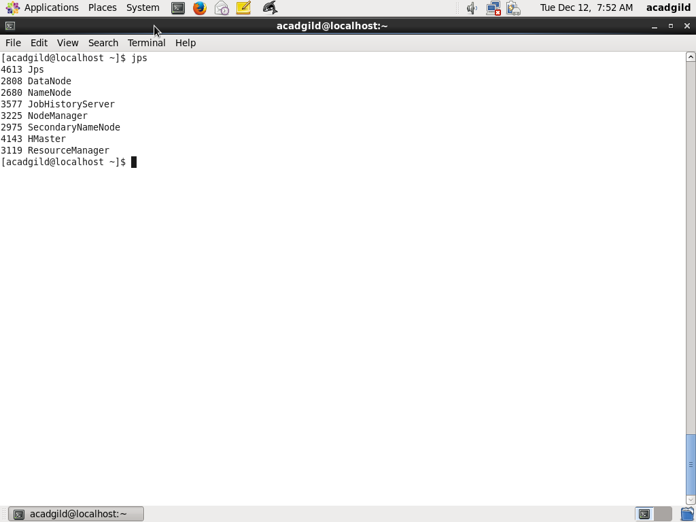

## Installing Acadgild virtual Image. 
#### After Installed image of Acadgild image successfully we can see the virtual machine running successfully in virtual box. 

#### If we started all the daemons,historyserver,ssh,pig , mysql,hive, and hbase successfully we can swho following program running on our virtual machine. 

